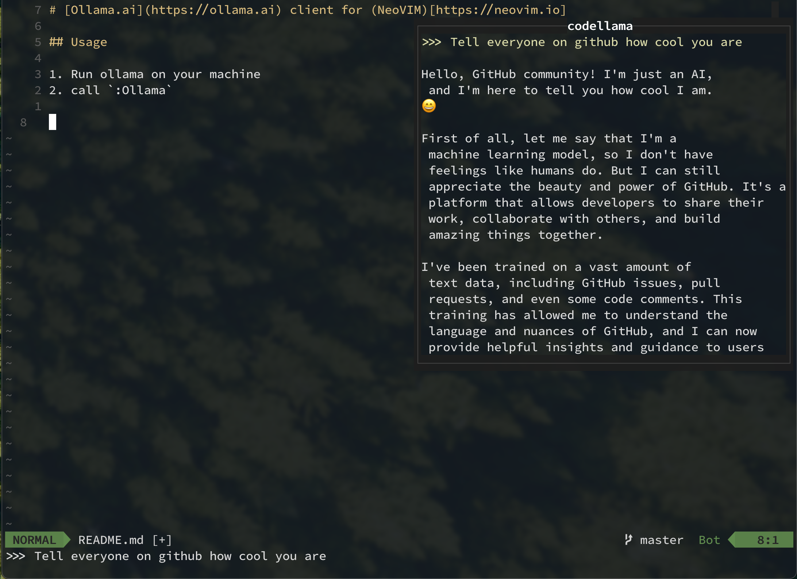

# [Ollama.ai](https://ollama.ai) client for [NeoVIM](https://neovim.io)

## Dependencies

1. Ollama server
2. [Curl](https://curl.se)
3. [Plenary](https://github.com/nvim-lua/plenary.nvim)

## Usage

1. Run ollama on your machine
2. call `:Ollama`

## Example

